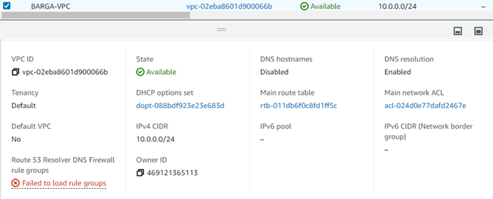

## Part 1
1. VPC
  - 
  - creates a virtual network defined by the user that protects/isolates data and resources in the cloud
  
2. Subnet
  - 
  - Makes networks more efficient by allowing them to pass by unnecessary routes
  - it is a range of ip addresses in your VPC
  
3. Internet Gateway
  - 
  - connects two different networks and allows the transfer/communication of data to different protocols
  - enables communication between your VPC and the internet
  - performs network address translation (NAT) for instances that have been assigned public IPv4 addresses
  
4. Routing Table
  - 
  - uses rules(routes) that help determine where network traffic from your subnet or gateway is directed
  
5. Security Group
  - 
  - controls inbound and outbound traffic for the EC2 instance and manages accounts
  
## Part 2
