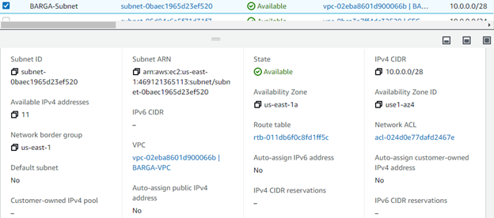
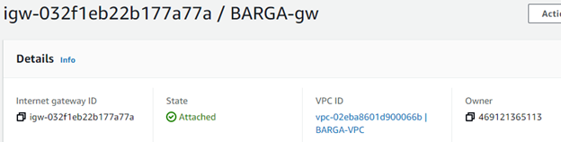
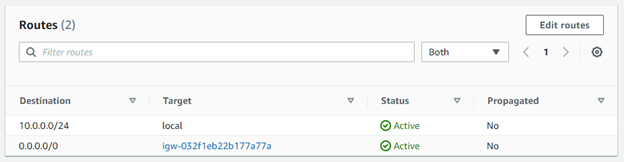
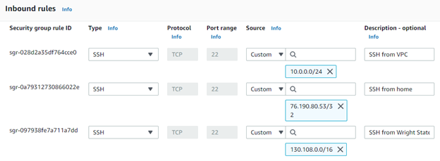
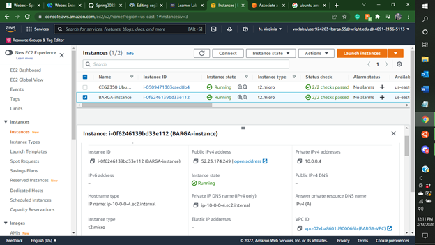
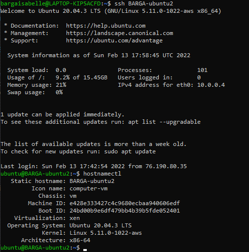

## Part 1
1. VPC
  - 
  - creates a virtual network defined by the user that protects/isolates data and resources in the cloud
  
2. Subnet
  - 
  - Makes networks more efficient by allowing them to pass by unnecessary routes
  - it is a range of ip addresses in your VPC
  
3. Internet Gateway
  - 
  - connects two different networks and allows the transfer/communication of data to different protocols
  - enables communication between your VPC and the internet
  - performs network address translation (NAT) for instances that have been assigned public IPv4 addresses
  
4. Routing Table
  - 
  - uses rules(routes) that help determine where network traffic from your subnet or gateway is directed
  
5. Security Group
  - 
  - controls inbound and outbound traffic for the EC2 instance and manages accounts
  
## Part 2
1. AMI: 04505e74c0741db8d (Ubuntu Server 20.04 LTS (HVM), SSD Volume Type)
  - ubuntu
- t2.micro
2. I selected 'Configure Instance Details' and scrolled to Network and selected my VPC
3. I decided to auto assign my IPv4 because I was hoping it would be graded before I had to worry about
  if someone bought it and I had to fix it. So, just choosing the easy way out hopefully.
4. Volume: I selected 16 GiB and the General Purpose SSD
5. Tags: I changed the Key to Name and for the value wrote "BARGA-instance"
6. Security group: I selected choose an existing security group and choose "BARGA-sg"
7. Skip because I auto assigned
8. 
9. sudo hostnamectl set-hostname BARGA-ubuntu2 --static (and log out and back in for it to change)
10. 
