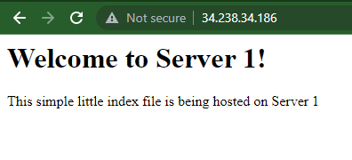
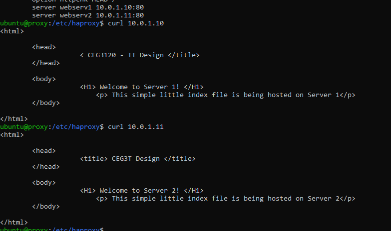

## Part 2 - Setup Load Balancing TODOs

1. Create an `/etc/hosts` OR `.ssh/config` file on each system that correlates hostnames to private IPs.
   - Description of how file is configured
2. Document how to SSH in between the systems utilizing their private IPs.
```
web serv1: ssh -i /home/ubuntu/.ssh/ceg3120-aws-vm.pem ubuntu@10.0.1.10 or ssh webserv1
web serv2: ssh -i /home/ubuntu/.ssh/ceg3120-aws-vm.pem ubuntu@10.0.1.11 or ssh webserv2
```
3. **_HAProxy configuration & documentation requirements_**
   - How to set up a HAProxy load balancer
     - What file(s) where modified & their location
         * haproxy.cfg
         * in the /etc/haproxy/ file
     - What configuration(s) were set (if any)
     ```
        frontend 34.238.34.186
           bind 10.0.0.10:80
           default_backend web_servers
           bind *:8404
           stats enable
           stats uri /stats
           stats refresh 10s
           stats admin if LOCALHOST

         backend web_servers
           balance roundrobin
           option httpchk HEAD /
           server webserv1 10.0.1.10:80
           server webserv2 10.0.1.11:80
     ```
     - How to restart the service after a configuration change
      ```
      sudo systemctl restart haproxy
      ```
     - Resources used (websites)
         * https://www.haproxy.com/blog/the-four-essential-sections-of-an-haproxy-configuration/
4. **_Webserver 1 & 2 configuration & documentation requirements_**
   - How set up a webserver
     - What file(s) were modified & their location
         * /var/www/html/index.html
     - What configuration(s) were set (if any)
     - Where site content files were located (and why)
         * located in the /var/www/apache2 file on the webserver instance it corresponded too
         * this would normally allow it to switch between servers and output the index.html file
     - How to restart the service after a configuration change
         * sudo systemctl restart apache2
     - Resources used (websites)
5. From the browser, when connecting to the proxy server, take two screenshots.
   - one screenshot that shows content from "server 1"
   
   - one screenshot that shows content from "server 2"
   - (adding proof that my webserver's are set up correctly (so we think) but it still wont switch between them on the browser)
   
   
6. (Optional) - link to your proxy so I can click it.
         * http://34.238.34.186/
