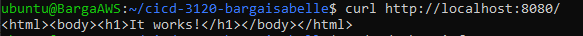
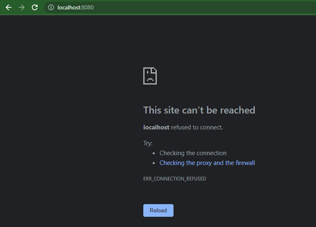
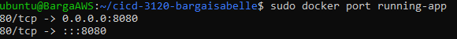

## Documentation

### Part 1 - Dockerize it

- Create `README.md` in main folder of your repo that details the following:
- Project Overview
- Run Project Locally
  - how you installed docker + dependencies (WSL2, for example)
    - sudo apt install docker.io
  - how to build the container
    - sudo docker build -t my-apache2 .
  - how to run the container
    - sudo docker run --rm -it -p 8080:80 ubuntu
  - how to view the project (open a browser...go to ip and port...)
    - http://localhost:8080/
    - http://127.0.0.1:8080




  
### Part 2 - GitHub Actions and DockerHub  
  
- Update `README.md` in main folder of your repo to include:

- Create DockerHub public repo
  - process to create
    - access Docker Hub
    - select create repo
    - add name/description
    - select create
- Allow DockerHub authentication via CLI using Dockhub credentials
  - Access account settings and click on security
  - Create "New Access Token" and select read, write, and delete
  - Save the token in a secure location for later access
- Configure GitHub Secrets
  - what credentials are needed - DockerHub credentials (do not state your credentials)
    - open Docker Hub account settings 
    - go to Security and click on secrets to hide your username and token
  - set secrets and secret names
    - you can refer to them in a YAML file using the .secrets tag and the name of the secret
    - docker hub username (secrets.DOCKER_USERNAME)
    - docker hub token (secrets.DOCKER_TOKEN)
- Configure GitHub Workflow
  - variables to change (repository, etc.)
    - adding the Docker Hub secrets (username and password, and the image name)

```
name: docker-build-push

on: [push]

env:
  DOCKER_REPO: mysite

jobs:
  docker-build-push:
    runs-on: ubuntu-latest
    steps:
      - name: checking out repo
        uses: actions/checkout@v3
      - run: echo "post-checkout" && ls -lah && pwd
      - name: login to docker hub
        uses: docker/login-action@v1
        with:
          username: ${{ secrets.DOCKER_USERNAME }}
          password: ${{ secrets.DOCKER_TOKEN }}
      - name: docker buildx
        uses: docker/setup-buildx-action@v1
      - name: build and push
        uses: docker/build-push-action@v2
        with:
          push: true
          tags: ${{secrets.DOCKER_USERNAME }}/${{ env.DOCKER_REPO }}:latest
```
  
### Part 3 - Deployment

- Container restart script
 ```
 #!/bin/bash

# Pull docker image
# Docker pull bargaisabelle/mysite:latest
# Kill old running container (to clear host port)
echo "stopping contianer"
docker stop cheese

# Removes old container/images
docker system prune -f -a

# Pull docker container post prune
echo "pulling from repo"
docker pull bargaisabelle/mysite:latest

# Run new container
echo "run container cheese"
docker run -d --name cheese --rm -p 80:80 bargaisabelle/mysite:latest
```
- Webhook task definition file
```
[Unit]
Description=Webhooks

[Service]
ExecStart=/home/ubuntu/go/bin/webhook -hooks /home/ubuntu/redeploy.json -hotreload

[Install]
WantedBy=multi-user.target
```
- Setting up a webhook on the server
  - How you created you own listener
  - How you installed and are running the [webhook on GitHub](https://github.com/adnanh/webhook)
    - First install Go: ```sudo snap install go```
    - Extract the files with tar: sudo tar -C /usr/local -xzf go1.18.1.linux-amd64.tar.gz
    - Can manually add the PATH to .profile or use ```echo "export PATH=$PATH:/usr/local/go/bin">> .profile```
    - Install webhook: ```go install github.com/adnanh/webhook@latest```
    - Redirect output to logs.txt: /home/ubuntu/go/bin/webhook -hooks /home/ubuntu/redeploy.json -verbose >> /home/ubuntu/logs.txt
- Setting up a notifier in GitHub or DockerHub
